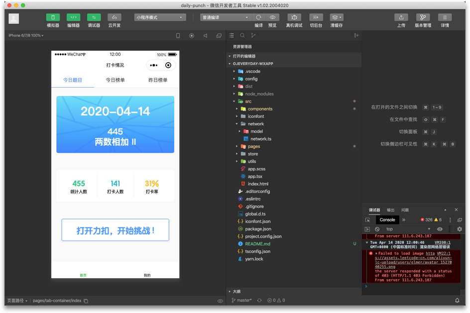

# ojeveryday-wxapp

# Description

这是每日一题官方微信小程序。改小程序致力于方便查看个人打卡情况及每日一题(http://ojeveryday.com/)榜单情况，也可以分享当日习题和当日本人打卡情况。

技术选型：[Taro](https://github.com/NervJS/taro)、[React](https://github.com/facebook/react)、[TypeScript](https://github.com/microsoft/TypeScript)、[mobx](https://github.com/mobxjs/mobx)

icon 方案：已经对接了 iconfont.cn，可以联系 @Desgard 增加 Project 权限

# Development

## Clone 仓库

```shell
$ git clone git@github.com:ojeveryday/ojeveryday-wxapp.git && cd ojeveryday-wxapp
```

## 使用 yarn 安装依赖

```shell
$ yarn
```

## 打包并采用 wxapp 模式进行调试

```shell
$ yarn dev:weapp
```

## 预览页面

下载[微信小程序开发者工具](https://developers.weixin.qq.com/miniprogram/dev/devtools/download.html)，选择『导入已有项目』，目录选择本地 Repo 根目录即可看到预览。



# MIT License

Copyright (c) 2020 ojeveryday-wxapp

Permission is hereby granted, free of charge, to any person obtaining a copy
of this software and associated documentation files (the "Software"), to deal
in the Software without restriction, including without limitation the rights
to use, copy, modify, merge, publish, distribute, sublicense, and/or sell
copies of the Software, and to permit persons to whom the Software is
furnished to do so, subject to the following conditions:

The above copyright notice and this permission notice shall be included in all
copies or substantial portions of the Software.
